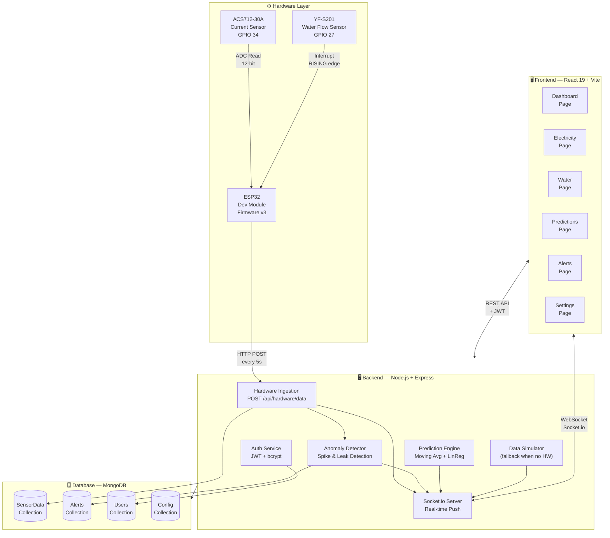
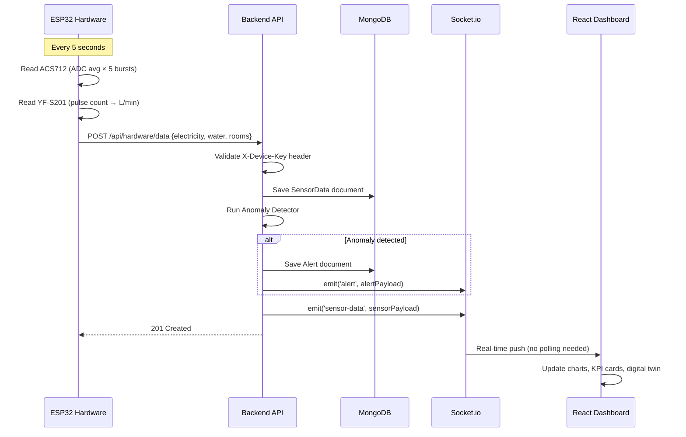
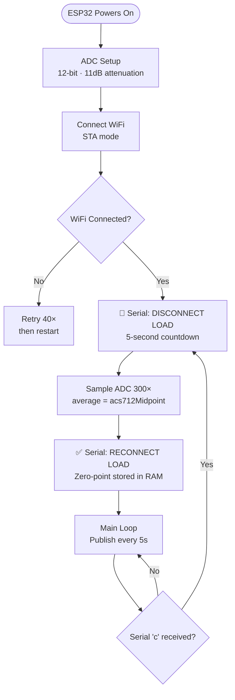
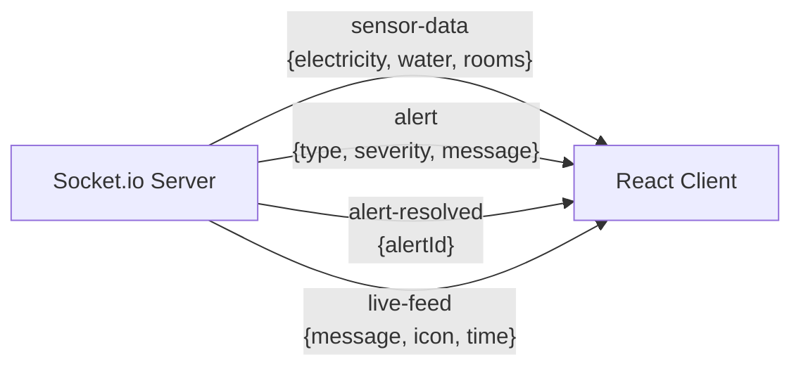
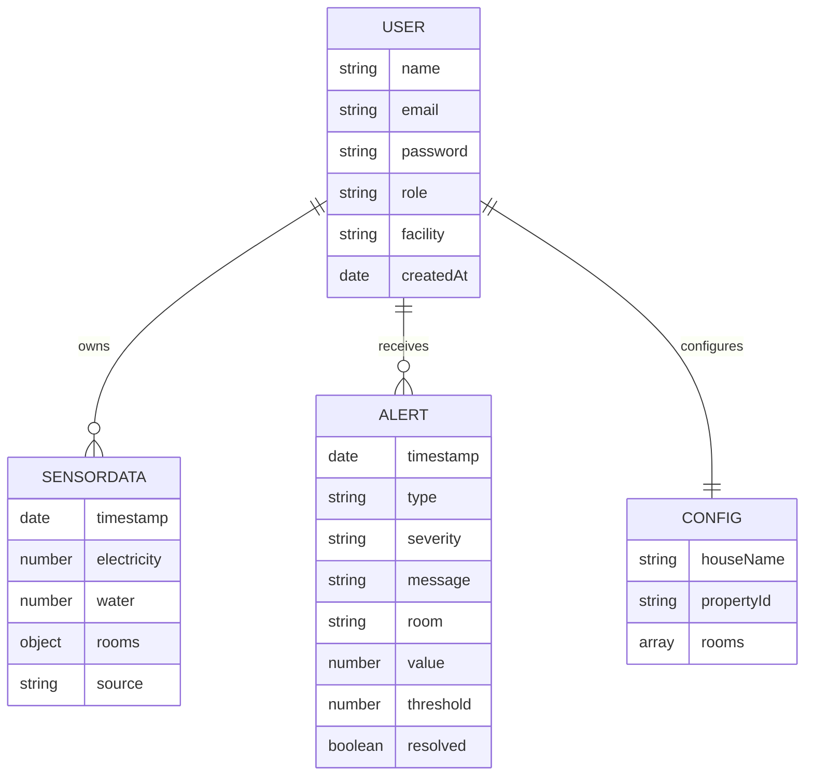

# 🏠 Smart-I-Sense

<div align="center">

**Real-Time IoT Electricity & Water Monitoring System**  
*ESP32 Hardware · Node.js Backend · React Dashboard · AI Predictions*

[](https://nodejs.org)
[](https://react.dev)
[](https://mongodb.com)
[](https://espressif.com)
[](https://docker.com)
[](LICENSE)

</div>

---

## 📖 Table of Contents

- [Overview](#-overview)
- [Live System Architecture](#-live-system-architecture)
- [Data Flow](#-data-flow)
- [Hardware Setup](#-hardware-setup)
- [Tech Stack](#-tech-stack)
- [Project Structure](#-project-structure)
- [Getting Started](#-getting-started)
- [ESP32 Firmware](#-esp32-firmware)
- [API Reference](#-api-reference)
- [WebSocket Events](#-websocket-events)
- [Database Schemas](#-database-schemas)
- [Docker Deployment](#-docker-deployment)
- [Troubleshooting](#-troubleshooting)

---

## 🌟 Overview

**Smart-I-Sense** is a full-stack IoT platform that monitors real-time electricity consumption and water flow across multiple rooms in a property. Physical sensors (ACS712 current sensor + YF-S201 water flow sensor) are connected to an ESP32 microcontroller, which POSTs live readings to a Node.js backend every 5 seconds. A React dashboard visualizes the data with AI-powered predictions and anomaly detection.

### ✨ Feature Highlights

| Category | Feature |
|----------|---------|
| 📊 **Dashboard** | Live KPI cards, room-by-room breakdown, auto-refresh every 5s |
| 🏠 **Digital Twin** | Interactive multi-room house visualization with status indicators |
| 📈 **Charts** | Time-series trends with 1H / 24H / 7D / 30D range toggle |
| 🧠 **AI Engine** | Moving average + linear regression with confidence scores |
| 🚨 **Alerts** | Auto anomaly detection — electricity spikes & water leaks |
| 📡 **Live Feed** | SOC-style real-time activity log via WebSocket |
| 🔐 **Auth** | JWT login/register with role-based access (admin/viewer) |
| 🔌 **Hardware** | Real ESP32 sensor integration over HTTP — no MQTT broker needed |
| 📥 **Export** | CSV export with per-room breakdown |
| 🐳 **Docker** | One-command full-stack deployment |

---

## 🏗️ Live System Architecture



---

## 🔄 Data Flow



---

## 🔌 Hardware Setup

### Components Required

| Component | Specification | Purpose |
|-----------|--------------|---------|
| ESP32 Dev Board | Any 30/38-pin variant | Main microcontroller |
| ACS712 Module | **30A variant** (red PCB) | Current / electricity sensor |
| YF-S201 Sensor | G1/2″ brass or plastic | Water flow measurement |
| 9V Battery + LED Strip | For demo load | Electricity demo load |
| Jumper Wires | M-to-M & M-to-F | Connections |
| Micro-USB Cable | Data cable (not charge-only) | Flashing & power |

---

### Wiring Diagram

```
┌─────────────────────────────────────────────────────┐
│                    ESP32 Dev Board                   │
│                                                      │
│  3V3 ──────────────────────── ACS712 VCC             │
│  GND ──────────────────────── ACS712 GND             │
│  GPIO34 (ADC1_CH6) ─────────── ACS712 OUT            │
│                                                      │
│  VIN (5V) ──────────────────── YF-S201 Red (VCC)     │
│  GND ──────────────────────── YF-S201 Black (GND)    │
│  GPIO27 ────────────────────── YF-S201 Yellow (SIG)  │
│                                                      │
│  GPIO2 (Built-in LED) ──── Status blink indicator    │
└─────────────────────────────────────────────────────┘

ACS712 Load Wiring:
  9V Battery (+) ──→ ACS712 IP+ ──→ ACS712 IP- ──→ LED Strip (+)
  9V Battery (-) ─────────────────────────────────→ LED Strip (-)
```

> ⚠️ **Critical:** Only use **ADC1 pins (GPIO32–39)** for ACS712. ADC2 is disabled when WiFi is active on ESP32!  
> ⚠️ YF-S201 requires **5V** — use the VIN pin, not 3.3V.

---

### ACS712 Calibration Flow



---

## 🛠️ Tech Stack

### Frontend
| Technology | Version | Role |
|-----------|---------|------|
| React | 19 | Component-based UI |
| Vite | 6 | Build tool & dev server |
| Tailwind CSS | v4 | Utility-first styling |
| Recharts | latest | Charts & data visualization |
| Framer Motion | latest | Animations & transitions |
| Socket.io Client | 4.x | Real-time WebSocket |
| Axios | 1.x | HTTP client with interceptors |
| Lucide React | latest | Icon library |

### Backend
| Technology | Version | Role |
|-----------|---------|------|
| Node.js | ≥18 | Runtime |
| Express | 4.x | REST API server |
| MongoDB + Mongoose | 8.x | Document database |
| Socket.io | 4.x | Real-time bidirectional comms |
| jsonwebtoken | 9.x | JWT auth tokens |
| bcryptjs | 3.x | Password hashing |
| express-validator | 7.x | Input validation |
| Jest + Supertest | latest | Unit + integration tests |

### Hardware
| Technology | Role |
|-----------|------|
| ESP32 (Arduino framework) | Microcontroller firmware |
| ACS712-30A | Current sensing via ADC |
| YF-S201 | Water flow via hardware interrupt |
| ArduinoJson v6 | JSON payload serialization |
| HTTP POST | Transport (no MQTT broker needed) |

### DevOps
| Technology | Role |
|-----------|------|
| Docker + Docker Compose | Containerization |
| Nginx | Frontend static serving |

---

## 📁 Project Structure

```
Smart-I-Sense/
│
├── hardware/
│   └── esp32/
│       ├── smart_i_sense_firmware/
│       │   ├── smart_i_sense_firmware.ino   # Main firmware (HTTP v3)
│       │   └── config.h                     # All user-configurable settings
│       └── HARDWARE_GUIDE.md
│
├── backend/
│   ├── config/
│   │   └── db.js                   # MongoDB connection
│   ├── models/
│   │   ├── SensorData.js           # Readings schema
│   │   ├── Alert.js                # Anomaly alerts schema
│   │   ├── User.js                 # Auth user schema
│   │   └── Config.js               # Room/device config schema
│   ├── routes/
│   │   ├── sensorRoutes.js         # GET history, latest
│   │   ├── hardwareRoutes.js       # POST /hardware/data (ESP32 ingestion)
│   │   ├── authRoutes.js           # Register, login, profile
│   │   ├── alertRoutes.js          # Alert CRUD
│   │   ├── predictionRoutes.js     # AI predictions
│   │   └── configRoutes.js         # Room/device config
│   ├── services/
│   │   ├── simulator.js            # Fallback data simulator
│   │   ├── predictionEngine.js     # Moving avg + linear regression
│   │   ├── anomalyDetector.js      # Spike & leak detection
│   │   └── mqttService.js          # Optional MQTT bridge
│   ├── middleware/
│   │   └── auth.js                 # JWT verification middleware
│   ├── tests/                      # Jest unit tests
│   ├── utils/
│   │   └── seedData.js             # Demo data seeder
│   └── server.js                   # Entry point: Express + Socket.io
│
├── frontend/
│   └── src/
│       ├── components/
│       │   ├── layout/             # Header, Sidebar, Layout wrapper
│       │   ├── dashboard/          # StatsCards, DigitalTwin, LiveFeed
│       │   ├── charts/             # TimeSeriesChart, PredictionChart
│       │   ├── alerts/             # AlertPanel, AlertItem, AlertsModal
│       │   ├── ai/                 # AIInsightsPanel
│       │   ├── auth/               # ProtectedRoute
│       │   ├── settings/           # RoomManager, DeviceManager
│       │   └── ui/                 # Toast, Skeleton, ErrorBoundary
│       ├── pages/                  # 7 route pages
│       ├── context/                # Socket, Theme, User, Auth providers
│       └── utils/                  # API client, helper functions
│
├── docker-compose.yml
├── .env.example
└── README.md
```

---

## 🚀 Getting Started

### Prerequisites

- **Node.js** ≥ 18.0.0
- **MongoDB** (local install or [MongoDB Atlas](https://cloud.mongodb.com))
- **Git**

### 1. Clone the Repository

```bash
git clone https://github.com/YOUR_USERNAME/Smart-I-Sense.git
cd Smart-I-Sense
```

### 2. Install Dependencies

```bash
# Backend
cd backend && npm install

# Frontend (new terminal)
cd frontend && npm install
```

### 3. Configure Environment

```bash
# Copy the example env file
cp .env.example backend/.env
```

Edit `backend/.env`:

```env
PORT=5000
MONGODB_URI=mongodb://localhost:27017/smartisense
CORS_ORIGIN=http://localhost:5173
JWT_SECRET=your-super-secret-jwt-key-change-this
DEVICE_API_KEY=smartisense-esp32-secret-2024
```

### 4. Start the Application

```bash
# Terminal 1 — Backend
cd backend
npm run dev

# Terminal 2 — Frontend
cd frontend
npm run dev
```

Open **http://localhost:5173** — register a new account to get started.

> 💡 The backend auto-seeds 24 hours of demo data and starts a real-time simulator on first run. Hardware data from ESP32 overrides the simulator automatically when detected.

---

## 📡 ESP32 Firmware

### Quick Setup

1. Open `hardware/esp32/smart_i_sense_firmware/config.h`
2. Set your credentials:

```cpp
// WiFi
#define WIFI_SSID       "Your_Network_Name"
#define WIFI_PASSWORD   "Your_Password"

// Backend — your PC's LAN IP (run `ipconfig` to find it)
#define BACKEND_HOST    "192.168.x.xx"
#define BACKEND_PORT    5000

// Sensor
#define ACS712_SENSOR_CONNECTED  true     // false = simulator mode
#define ACS712_VCC_VOLTAGE       3.3f     // 3.3f if powered from ESP32 3V3 pin
#define MAINS_VOLTAGE            9.0f     // 9.0f for 9V battery demo, 230.0f for AC mains
```

3. Install **ArduinoJson** library (Sketch → Library Manager)
4. Board: `ESP32 Dev Module` — Upload Speed: `921600`
5. Upload and open Serial Monitor at **115200 baud**

### Serial Output (After Upload)

```
╔══════════════════════════════════════════╗
║  Smart-I-Sense  ESP32 Firmware v3 (HTTP) ║
╚══════════════════════════════════════════╝

📶 Connecting to: MyHomeNetwork..........
✅ WiFi Connected!
   ESP32 IP  : 192.168.1.55
   Signal    : -62 dBm

━━━━━━━━━━━━━━━━━━━━━━━━━━━━━━━━━━━━━━━━━━━━━━━━━━━
🔴  ACS712 CALIBRATION — DISCONNECT LOAD / LED STRIP NOW
   Calibrating in: 5... 4... 3... 2... 1...
   📸 Sampling now...
   ✅ Zero-point set: ADC 2241  (1.806 V)
   RECONNECT the load / LED strip now.
━━━━━━━━━━━━━━━━━━━━━━━━━━━━━━━━━━━━━━━━━━━━━━━━━━━

✅ Backend reachable — ready to send data!
✅ Setup complete — entering main loop
   💡 Tip: type 'c' + Enter in Serial Monitor to re-calibrate ACS712 anytime.

─────────────────────────────────────────
📤 POST → http://192.168.1.50:5000/api/hardware/data
   ⚡ Electricity : 12.4 W
   💧 Water Flow  : 26.40 L/min
   📶 WiFi Signal : -64 dBm
   🔬 RAW → Amps: 1.378 A  Watts (pre-filter): 12.40 W  Midpoint: 2241
   Status         : ✅ 201 Created — data saved!
─────────────────────────────────────────
```

> 💡 **Re-calibrate anytime** without rebooting: type `c` + Enter in Serial Monitor.

---

## 📋 API Reference

### Authentication

| Method | Endpoint | Auth | Description |
|--------|----------|------|-------------|
| `POST` | `/api/auth/register` | ❌ | Create new user account |
| `POST` | `/api/auth/login` | ❌ | Get JWT token |
| `GET` | `/api/auth/me` | 🔒 | Get current user profile |
| `PATCH` | `/api/auth/profile` | 🔒 | Update profile |

### Sensor Data

| Method | Endpoint | Auth | Description |
|--------|----------|------|-------------|
| `GET` | `/api/latest` | 🔒 | Latest sensor reading |
| `GET` | `/api/history?range=1h\|24h\|7d\|30d` | 🔒 | Time-series history |
| `POST` | `/api/sensor-data` | 🔒 | Submit manual reading |

### Hardware Ingestion (ESP32)

| Method | Endpoint | Auth | Description |
|--------|----------|------|-------------|
| `POST` | `/api/hardware/data` | 🗝️ Device Key | ESP32 sensor POST |
| `GET` | `/api/hardware/ping` | ❌ | Backend reachability check |

### Predictions & Alerts

| Method | Endpoint | Auth | Description |
|--------|----------|------|-------------|
| `GET` | `/api/predictions` | 🔒 | AI forecast + suggestions |
| `GET` | `/api/alerts` | 🔒 | All alerts (filterable) |
| `PATCH` | `/api/alerts/:id/resolve` | 🔒 | Mark alert resolved |

### Configuration

| Method | Endpoint | Auth | Description |
|--------|----------|------|-------------|
| `GET` | `/api/config` | 🔒 | Room/device configuration |
| `PATCH` | `/api/config` | 🔒 | Update rooms, thresholds |
| `POST` | `/api/config/diagnose` | 🔒 | Re-run anomaly detection |
| `GET` | `/api/health` | ❌ | System health check |

> 🔒 = `Authorization: Bearer <jwt_token>` header required  
> 🗝️ = `X-Device-Key: <DEVICE_API_KEY>` header required

---

## 📡 WebSocket Events



| Event | Direction | Payload |
|-------|-----------|---------|
| `sensor-data` | Server → Client | `{ electricity, water, rooms, timestamp }` |
| `alert` | Server → Client | `{ type, severity, message, room, value }` |
| `alert-resolved` | Server → Client | `{ alertId }` |
| `live-feed` | Server → Client | `{ message, icon, time }` |

---

## 🗄️ Database Schemas



### SensorData `rooms` structure

```json
{
  "timestamp": "2026-05-12T14:00:00Z",
  "electricity": 42.5,
  "water": 26.4,
  "rooms": {
    "livingRoom":  { "electricity": 14.9, "water": 26.4 },
    "bedroom":     { "electricity": 10.6, "water": 0 },
    "kitchen":     { "electricity": 10.6, "water": 0 },
    "bathroom":    { "electricity": 6.4,  "water": 0 }
  },
  "source": "hardware"
}
```

---

## 🐳 Docker Deployment

```bash
# Build and start all services (MongoDB + Backend + Frontend + Nginx)
docker-compose up -d

# Watch logs
docker-compose logs -f backend

# Stop everything
docker-compose down

# Rebuild after code changes
docker-compose up -d --build
```

App available at **http://localhost:3000**

---

## 🧪 Running Tests

```bash
cd backend
npm test
```

Tests cover:
- Prediction engine: moving average, linear regression, variance calculation
- Helper functions: `formatWatts`, `formatWater`, status color mapping, room labels
- API endpoints: sensor submission, auth flow

---

## 🔍 Troubleshooting

| Symptom | Likely Cause | Fix |
|---------|-------------|-----|
| `Electricity: 0.0 W` always | `ACS712_SENSOR_CONNECTED false` | Set to `true` in `config.h` |
| Constant ghost reading (e.g. 21W) with no load | Calibration ran with load connected | Type `c` in Serial Monitor to re-calibrate with load OFF |
| `0.0 W` even with LED strip connected | Calibration captured "load ON" as zero | Type `c` + Enter to re-calibrate properly |
| Upload fails | Wrong COM port / missing USB driver | Install CP2102 or CH340 driver |
| WiFi stuck connecting | Wrong credentials or 5GHz network | ESP32 is 2.4GHz only; check SSID case |
| `Connection failed (-1)` in serial | Wrong `BACKEND_HOST` IP | Run `ipconfig`, use WiFi IPv4 address |
| Water always 0 L/min | YF-S201 on 3.3V | Move to VIN (5V) pin |
| Noisy readings | ESP32 ADC2 used | Switch to GPIO 32–39 (ADC1 only) |
| No data in dashboard | Backend `.env` missing | Copy `.env.example` → `backend/.env` |

---

## 🔮 Roadmap

- [x] Real-time WebSocket dashboard
- [x] JWT authentication
- [x] AI predictions (moving average + linear regression)
- [x] Anomaly detection (spikes + leaks)
- [x] ESP32 HTTP firmware v3 (no MQTT broker)
- [x] ACS712 auto-calibration with serial re-trigger
- [x] Docker deployment
- [ ] Multi-property support
- [ ] React Native mobile app
- [ ] LSTM / Prophet ML models
- [ ] OTA firmware updates

---

## 🎨 Design System

| Token | Value | Usage |
|-------|-------|-------|
| Background | `#0B0F1A` | Dark navy base |
| Card | `rgba(255,255,255,0.04)` | Glassmorphism surfaces |
| Accent Cyan | `#22D3EE` | Primary highlights |
| Accent Teal | `#14B8A6` | Secondary highlights |
| Status Green | `#22C55E` | Normal / OK |
| Status Amber | `#F59E0B` | Warning |
| Status Red | `#EF4444` | Critical alert |
| Font UI | Outfit | Headings & labels |
| Font Data | JetBrains Mono | Numbers & readings |

---

## 📄 License

Built for academic/research purposes as a **Capstone Project**.  
Not licensed for commercial use.

---

<div align="center">

**Built with ❤️ using React · Node.js · MongoDB · ESP32**

*Smart-I-Sense — Sense Smarter, Live Better*

</div>
